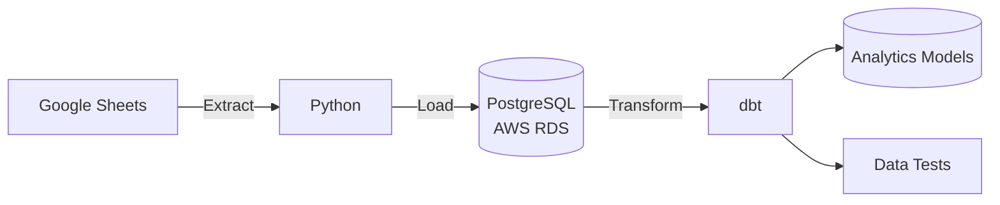

# Google Sheets Data Pipeline

An end-to-end data engineering project that extracts data from Google Sheets using Python, loads it into PostgreSQL hosted on AWS RDS, and transforms and tests the data using dbt.

## 🛠️ Tech Stack

- **Python** — Data extraction and loading
- **Google Sheets API** — Source data
- **PostgreSQL** — Data warehouse
- **AWS RDS** — Cloud-hosted PostgreSQL database
- **dbt** — Data transformation and testing

## 🏗️ Architecture

The pipeline follows a simple ELT workflow:

### Data Flow

1. **Extract** — Python retrieves source data from Google Sheets.
2. **Load** — The raw data is loaded into PostgreSQL hosted on AWS RDS.
3. **Transform** — dbt transforms the raw data into structured analytical models.
4. **Test** — dbt tests are used to validate data quality.

## 📊 Dataset

The source data is stored in Google Sheets and contains three main fields:

| Column | Description |
| --- | --- |
| `Date` | Date associated with the recorded value |
| `Dimension` | Category or dimension used to group the data |
| `Value` | Numeric value associated with the dimension |

The pipeline extracts this data from Google Sheets and loads it into PostgreSQL, where dbt is used to transform it into analytical models.

# Steps:

      . Created a Postgresql database in AWS RDS
 
      . Read data from google sheet and load it to the postgresql
 
      . Connected to the postgresql database with dbt
 
      . Created models and tests in dbt
 
      . Transformed the data into new schema (dbt_pkhoshhalsoustani)

This repository consists of the ReadData.py file for loading the data in python folder and the dbt models and tests files for transformation in models and tests/generic folders. 

# dbt

In this project, you will see two models. The first one is a raw model from the source of data which is in Postgres AWS RDS and the second one is fact_calls which loads data from the raw model and do transformations for getting the expected results.

There is a schema.yml file that describes tables and columns also some dbt built-in tests such as not null and unique were created on the columns. I created a generic test and used it for checking the total_duration with other existing durations (Ringing, Connected, and Wrap).

# python

Data from google sheets was extracted by getting access to gcp account and having required credentials. Then data was stored in pandas dataframe and was moved to postgres sql database in aws rds servic.

More details were commented in the scripts.

